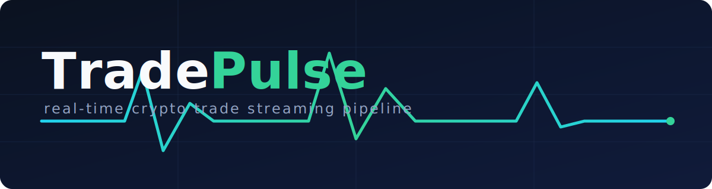
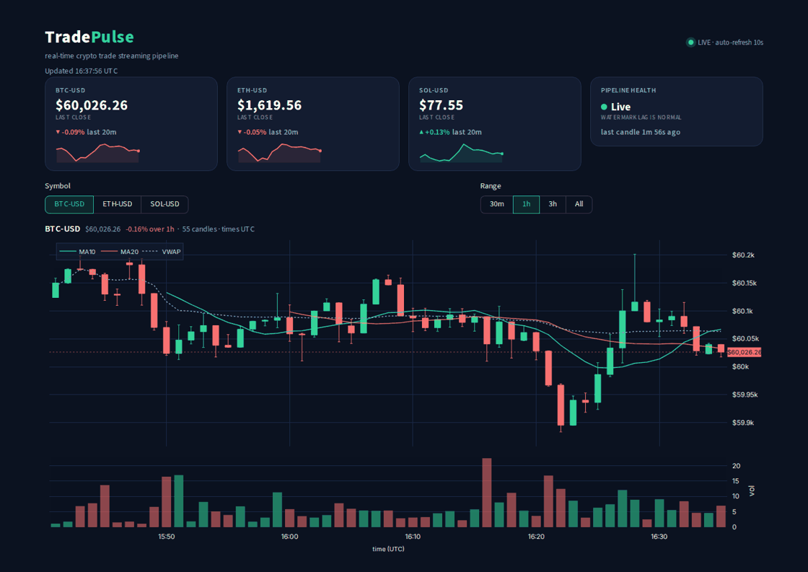
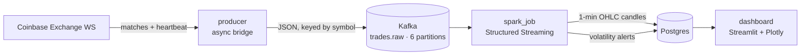

<p align="center">
  
</p>

# TradePulse

[](https://github.com/aakashshahani/tradepulse/actions/workflows/ci.yml)
[](https://codespaces.new/aakashshahani/tradepulse)
[](LICENSE)

TradePulse is a real-time streaming data pipeline for crypto market data. It
bridges Coinbase's public trade feed into Kafka, aggregates trades into
1-minute OHLC candles and volatility alerts with Spark Structured Streaming,
persists them to Postgres, and serves a live Streamlit dashboard. The whole
stack runs from a single `docker compose up`.

<p align="center">
  
</p>

## Architecture



- **producer** subscribes to Coinbase's `matches` and `heartbeat` channels and
  republishes each trade to `trades.raw`, keyed by symbol (per-symbol ordering),
  with an idempotent Kafka producer. Reconnects with exponential backoff.
- **spark_job** parses `trades.raw` against an explicit schema, drops malformed
  records, and computes per-symbol 1-minute candles with a watermark. Finalized
  candles are written to `candles`; candles whose move exceeds a threshold also
  write to `alerts`.
- **dashboard** reads `candles`, `alerts`, and a metrics table (read-only) and
  renders live charts, KPIs, and an alerts feed, auto-refreshing every 10s.

## Quick start

From a clean clone:

```bash
git clone https://github.com/aakashshahani/tradepulse
cd tradepulse
cp .env.example .env
docker compose up -d --build
```

Then open the dashboard at **http://localhost:8501**. The first 1-minute candles
land about two minutes after startup (window length plus watermark); until then
the dashboard shows a clear "waiting for data" state.

No local Docker? Click **Open in GitHub Codespaces** above to build and run the
whole stack in the cloud, with the dashboard port forwarded automatically.

A longer walkthrough of the architecture and the design tradeoffs is in
[docs/architecture.md](docs/architecture.md).

## Services

| Service      | Image                | Purpose                                                        |
|--------------|----------------------|----------------------------------------------------------------|
| `kafka`      | `apache/kafka:4.3.1` | Single-node KRaft broker (broker + controller, no ZooKeeper).  |
| `kafka-init` | `apache/kafka:4.3.1` | One-shot: creates `trades.raw` with 6 partitions, then exits.  |
| `postgres`   | `postgres:18`        | Pipeline schema, persistent named volume.                      |
| `producer`   | built locally        | Coinbase Exchange WS to `trades.raw`.                          |
| `spark_job`  | built locally        | Structured Streaming: `trades.raw` to candles + alerts.        |
| `dashboard`  | built locally        | Read-only Streamlit + Plotly UI on `http://localhost:8501`.    |

## Project layout

```
tradepulse/
├── docker-compose.yml
├── .env.example
├── assets/                 # banner, dashboard media
├── sql/init.sql            # schema, loaded on first Postgres startup
├── schemas/                # JSON Schema contract for trades.raw
├── producer/               # Coinbase to Kafka bridge (+ tests)
├── spark_job/              # Spark candle + alert job (+ tests)
├── dashboard/              # Streamlit dashboard
└── .github/workflows/ci.yml
```

## Design decisions

- **KRaft over ZooKeeper.** Kafka 4.x runs KRaft natively, so one process is
  both broker and controller. There is no separate ZooKeeper ensemble to run,
  secure, and monitor, which is fewer moving parts for a single-node stack (and
  ZooKeeper is removed in Kafka 4 anyway).
- **confluent-kafka over kafka-python.** confluent-kafka wraps librdkafka (C),
  giving higher throughput and first-class idempotent-producer support
  (`enable.idempotence`). kafka-python is pure Python, slower, and has lagged on
  newer broker features.
- **psycopg2 over Spark's JDBC writer for the sink.** Spark's built-in JDBC
  writer only emits plain `INSERT`; it cannot express `ON CONFLICT`. The sink
  needs an idempotent duplicate-skip on checkpoint replay, so it uses
  `foreachBatch` + `psycopg2` `execute_values` with `ON CONFLICT DO NOTHING`. A
  bonus is that a candle and its derived alert commit in one transaction.
- **Watermark + append instead of upsert.** With a 1-minute watermark and
  `append` output mode, Spark emits each window's candle exactly once, after the
  window is provably final. That keeps the write a plain `INSERT` with no
  read-modify-write upsert and no last-writer-wins races. The `ON CONFLICT DO
  NOTHING` covers only the rare crash-between-write-and-checkpoint replay.
- **Partition pre-creation.** `trades.raw` is created with 6 partitions by a
  one-shot `kafka-init` service instead of relying on auto-creation (which makes
  one partition). Keying by symbol preserves per-symbol ordering regardless, and
  6 partitions leaves headroom for consumer parallelism.

## Scaling considerations

- **Partition count and consumer parallelism.** A partition is Kafka's unit of
  parallelism: within a consumer group, at most one consumer reads a given
  partition. 6 partitions means up to 6 parallel readers for `trades.raw`. With
  3 symbols keyed today only 3 partitions carry data, but the headroom is there
  for more symbols or scaling out. Raising parallelism means raising partitions
  (and repartitioning existing data if ordering must be preserved).
- **local[*] to a real cluster.** The Spark job runs `master("local[*]")`
  in-process. Moving to a cluster means pointing `master` at a standalone / YARN
  / Kubernetes master, shipping the job and its Kafka connector (via `--packages`
  or a bundled jar), sizing executors, and moving the checkpoint to shared
  storage (HDFS/S3). The job logic does not change, only submission and config.
- **Extended Coinbase disconnect.** The producer reconnects with jittered
  exponential backoff (capped at 30s), so short outages self-heal. During a long
  outage no trades flow, so no candles are produced; the dashboard's health card
  moves to Lagging then Stale. When the feed returns, the producer resumes and
  Spark continues from its checkpoint. Nothing is fabricated for the gap: candles
  simply do not exist for those minutes, and the chart breaks the MA/VWAP lines
  across the gap rather than interpolating.

## Observability

- **Healthchecks** on every service: producer and spark_job use a heartbeat file
  (refreshed on each trade / each streaming-progress event) checked by a Docker
  `HEALTHCHECK`; postgres uses `pg_isready`; kafka uses the broker API.
- **Throughput logging** in the producer: per-symbol trades/sec roughly every
  10s, so liveness is visible without a consumer.
- **Malformed-record handling.** Records that fail parsing are counted per batch,
  accumulated in a `pipeline_metrics` table (surfaced on the dashboard), and
  republished with their original payload to a `trades.dlq` dead-letter topic for
  inspection or replay, rather than being silently dropped.
- The alerts panel shows the **actual configured threshold**, and the chart's
  MA/VWAP overlays are null across data gaps rather than interpolating, so the UI
  never implies data it does not have.

## Fault tolerance

The pipeline recovers from a mid-stream crash with no lost or duplicated candles.
Spark Structured Streaming checkpoints its Kafka offsets and window state to a
persistent volume, so on restart it resumes from the last committed batch instead
of reprocessing from scratch. The sink's `ON CONFLICT DO NOTHING` covers the one
window that may be replayed if the process dies between the write and the
checkpoint commit. The producer independently reconnects to Coinbase with
jittered exponential backoff.

You can watch this happen:

```bash
bash scripts/demo_recovery.sh
```

It records the candle count, kills `spark_job` mid-stream, restarts it, and shows
candles continuing with zero duplicates.

## Testing

```bash
# producer
cd producer && pip install -r requirements.txt pytest && python -m pytest -q

# spark_job (needs a JDK 17)
cd spark_job && pip install -r requirements.txt && python -m pytest -q
```

Coverage: `transform_match` (producer); OHLC picking and the `(ts, trade_id)`
tie-break, `pct_change` and the alert threshold boundary, and the malformed-row
filter (spark_job). An integration test spins up Postgres with testcontainers
and runs the real sink end to end, asserting candles + alerts land and that a
replayed batch is idempotent. CI (GitHub Actions) runs `ruff` plus both suites
on every push and PR.

## Future work

Deferred deliberately, not missing:

- **Sub-second raw-trade ticker.** Have the producer also write to `raw_trades`
  so the dashboard can show a live price between 1-minute candle closes.
- **Schema Registry + Avro.** Replace the JSON Schema contract in `schemas/` with
  a registry-enforced schema for producer/consumer compatibility guarantees.

## Tearing down

```bash
docker compose down          # stop containers, keep the Postgres volume
docker compose down -v       # also remove volumes (wipes data, re-runs init.sql)
```

> `sql/init.sql` runs only when the Postgres data volume is empty. Kafka has no
> persistent volume, so `trades.raw` is recreated by `kafka-init` on each `up`.
