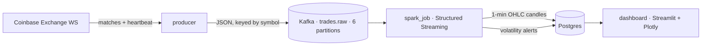

# Building TradePulse: a real-time OHLC pipeline you can run in one command

TradePulse takes Coinbase's live trade feed and turns it into 1-minute
candlestick data and volatility alerts, in real time, with the correctness
guarantees you would expect from a production streaming system. This is a
walkthrough of how it works and, more importantly, why it is built the way it
is. The tradeoffs are the interesting part.

## The shape of the system



Four moving parts plus Kafka and Postgres, wired together with Docker Compose.
A producer bridges the exchange into Kafka, a Spark job does the stateful
aggregation, Postgres stores the results, and a read-only dashboard renders
them. Everything starts with `docker compose up`.

## Decision 1: KRaft, not ZooKeeper

Kafka historically needed a separate ZooKeeper ensemble for metadata and
controller election. Kafka 4.x runs in KRaft mode, where the broker is also the
controller, and ZooKeeper is gone entirely. For a single-node stack that means
one process instead of two to run, secure, and monitor. There was no reason to
carry ZooKeeper's operational weight for a project that does not need it.

## Decision 2: confluent-kafka over kafka-python

The producer uses confluent-kafka, which wraps librdkafka (the C client). That
buys real throughput and, more importantly here, first-class idempotent-producer
support via `enable.idempotence`. kafka-python is pure Python, slower, and has
historically lagged on newer broker features. When the client library is doing
the heavy lifting of exactly-once semantics on the write path, you want the
battle-tested C implementation underneath.

## Decision 3: watermark + append, not upsert

This is the core correctness decision. Candles are a windowed aggregation:
"group all trades for BTC-USD between 14:32:00 and 14:33:00 and compute OHLC."
The hard question in streaming is *when is a window done?* Trades can arrive
late and out of order.

Spark answers this with an **event-time watermark**. With a one-minute
watermark, Spark holds a window open until it is confident no more trades for it
will arrive, then emits the candle exactly once in **append** output mode. That
single guarantee cascades into everything downstream: because each candle is
emitted once and only once, and only when final, the database write can be a
plain `INSERT`. No read-modify-write upsert, no last-writer-wins race, no
partial candles ever hitting the table.

Open and close are the first and last trade in the window by time. Rather than
sort, the job uses `min_by(price, (ts, trade_id))` and
`max_by(price, (ts, trade_id))`, which are order-independent aggregations with a
deterministic tie-break. High, low, and volume are `max`, `min`, and `sum`.

## Decision 4: a psycopg2 sink, not Spark's JDBC writer

Structured Streaming has no built-in JDBC sink, so a `foreachBatch` is required
to write to Postgres at all. The obvious move inside `foreachBatch` is Spark's
`df.write.jdbc(...)`, but it only emits plain `INSERT`. That is fine for candles
given append semantics, but there is one gap: if the process dies *between* the
database write and the checkpoint commit, a replay will retry that batch. The
`INSERT` would then hit a duplicate key.

So the sink uses psycopg2 with `execute_values` and
`ON CONFLICT (symbol, window_start) DO NOTHING`. This is not an upsert (there is
no `UPDATE`); it is a safe duplicate-skip that makes replay a no-op. A bonus of
owning the connection: a candle and its derived alert are written in the same
transaction, so they can never disagree.

## Decision 5: pre-create the topic with 6 partitions

A partition is Kafka's unit of parallelism, so partition count is a ceiling on
consumer parallelism. Auto-creation makes one partition, which caps you at one
reader forever. A one-shot `kafka-init` service creates `trades.raw` with six
partitions up front. Messages are keyed by symbol, so per-symbol ordering holds
regardless of partition count, and the extra partitions are headroom for more
symbols or a scaled-out consumer later.

## Being honest in the UI

The dashboard makes a point of never implying data it does not have. The
pipeline-health card labels its own lag ("watermark lag is normal") rather than
pretending to be a sub-second ticker. The alerts panel prints the actual
configured threshold instead of letting a demo-tuned value look like a real one.
And the moving-average and VWAP overlays go null across data gaps rather than
drawing a straight line through a period with no trades. Small things, but they
are the difference between a chart that informs and a chart that misleads.

## What I would do next

Deferred deliberately, not missing:

- **Sub-second raw-trade ticker.** Persist individual trades to `raw_trades` so
  the dashboard can show a live price between candle closes.
- **Schema Registry.** Replace the JSON Schema contract with a registry-enforced
  schema for real producer/consumer compatibility guarantees.

## Running it

```bash
git clone https://github.com/aakashshahani/tradepulse
cd tradepulse && cp .env.example .env
docker compose up -d --build
# dashboard at http://localhost:8501
```
